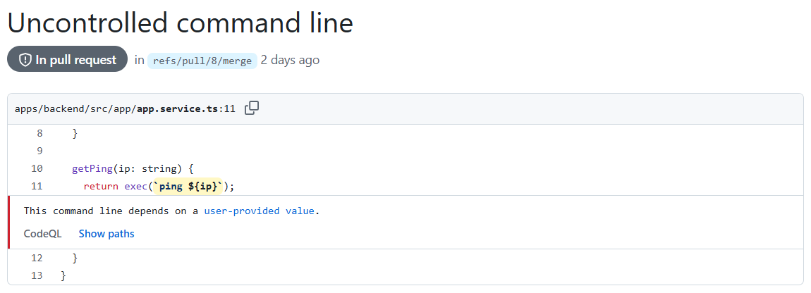
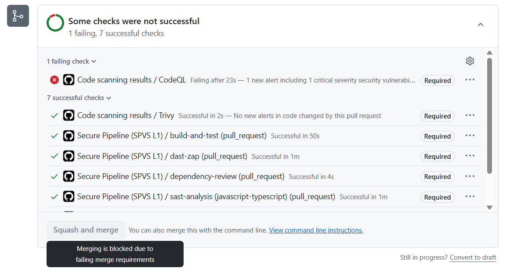
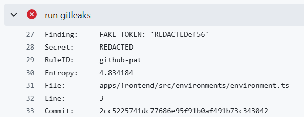
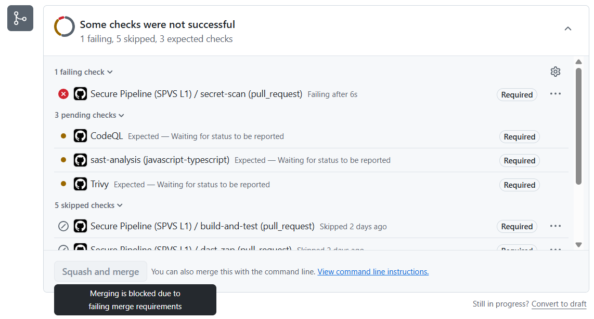

# AppSec CI/CD Blueprint: Angular & NestJS
This repository presents a case study of a pipeline that adheres to the OWASP SPVS (Software Pipeline Verification Standard) Level 1.

## Most pipelines are insecure by design
Typical CI/CD setups often have vulnerabilities and insecure practices, such as:
* Security scans for repository code and third-party packages are not performed, or vulnerable packages are identified, but without failing the pipeline.
* Secrets can be committed to the repo and/or not obscured in logs.
* Lack of a formal policy regarding secure development practices and security standards for developer workstations.
* Only manual deployment, without any automated security checks.

## Stop merging PRs with insecure code
Your pipeline only checks if the code builds and tests pass? Is there any security in the delivery chain?
Don't have a secure development policy and endpoint security standards?
This results in secrets and data leaks, unhardened environments, and vulnerable code and dependencies in production.

## Implement OWASP SPVS, and a pipeline can be your security guard
Implement OWASP SVPS controls into a pipeline, and it will work as a guard to protect your repo from insecure code.
It implements automated checks and prevents from merging and deploying insecure code.

## What is OWASP SPVS?
OWASP Software Pipeline Verification Standard (SPVS) provides controls to make sure your pipeline is secure during the whole SDLC, from planning to the maintenance stage.
It provides controls for CI/CD pipelines, but it's also about developer machines.
Below you can find a list of chosen SPVS controls:
* Secrets are encrypted both at rest and in transit
* Endpoint Protection is running on all developer workstations.
* Full Disk encryption is set up and enabled on developer laptops
* First-party code security tool conducting monthly security scans on production repositories
* Automated deployment scripts are used to minimize human error

## This pipeline is compliant with SPVS L1
The `.github/workflows/secure-pipeline.yml` workflow meets SPVS L1 requirements, especially:
* Every developer is obliged to [acknowledge](docs/docs-acknowledgements.md) and comply with [endpoint security standards](docs/endpoint-security-standards.md) and [secure development policy](secure-development-policy.md).
* Husky prevents committing secrets in git tracked files, and gitleaks verifies if there are any during pipeline execution
* Dependency scan is performed and fails a pipeline if high or critical severity is detected.
* SAST and DAST scanning all apps in the monorepo and failing the pipeline if high or critical severity is detected.
* Automatic deployment to the prod environment if the pipeline passes, without any manual activity required.

## How does it work?
Every Pull Request is checked, and if a pipeline fails, you're unable to merge it.
Every week, the master branch is also checked for vulnerabilities, e.g., vulnerable npm package version.
Check the real-world examples of failed pipelines in the Pull Requests tab. Some of the examples are described below.

### Example 1: Detected the high or critical vulnerability
Pipeline checks the whole codebase and used npm packages for known vulnerabilities.
If high or critical severity is detected, then the pipeline fails and prevents the merge.

### Example 2: Detected a secret in a file
Husky prevents commiting a secret in git tracked files.
If the developer use `--no-verify` flag when commiting then a pipeline will find it and block the merge.

## Why do you need this?
Implementation of OWASP SPVS controls protects the supply chain and security of your pipeline and meet requirements of compliance with modern standards like NIST 800-53.

## Any questions?
Reach out to me on [LinkedIn](https://www.linkedin.com/in/karol-lech/).
